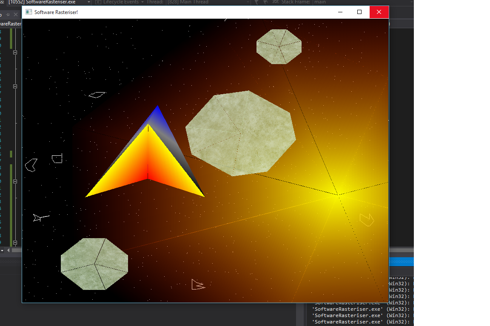

# Software Rasteriser

Software rasteriser with a scene demonstrating use of primitives such as points, lines, line loops, traingles, triangle fans, triangle strips. Demonstrates models using meshes, interpolated colours, transparency, and textures. Also demo's translations, and rotations.

## Getting Started

Clone and run with visual studio.

## Built With

* Visual Studio 2015
* NCLGL - Classes from this framework were used.

## Screenshots

Sample console output:

## Authors

* **Geoff Whitehead - (https://github.com/geoffwhitehead)
* **Richard Davidson - Newcastle University

## License

This project is licensed under the MIT License - see the [LICENSE.md](./LICENSE.md) file for details
